# Install Docker Toolbox in Windows Home Edition, step by step

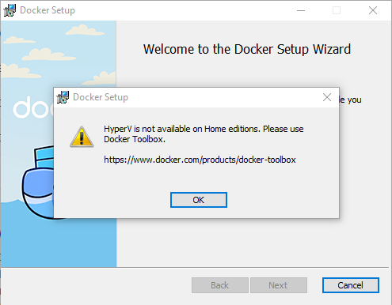

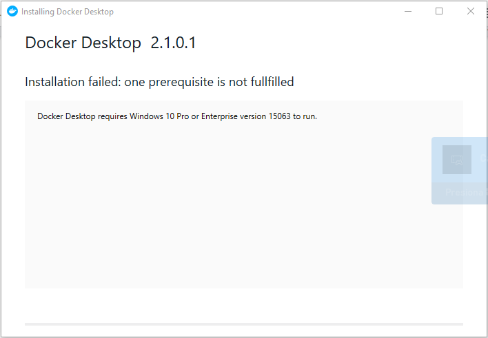

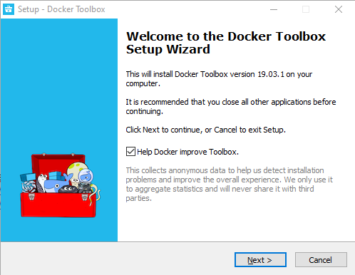

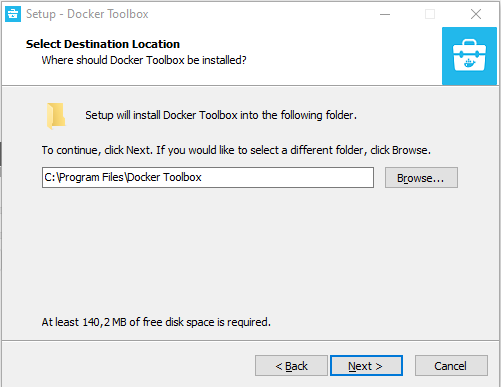

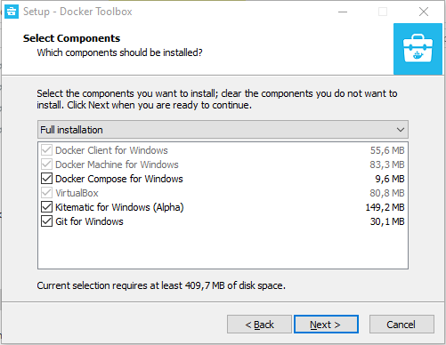

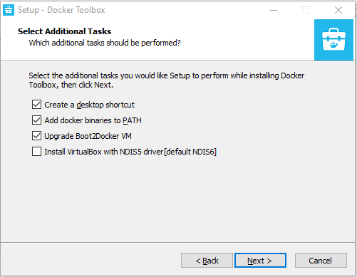

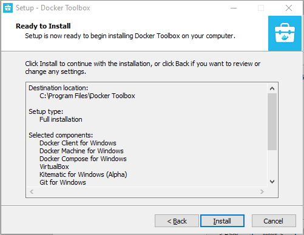

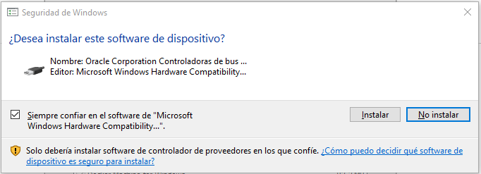

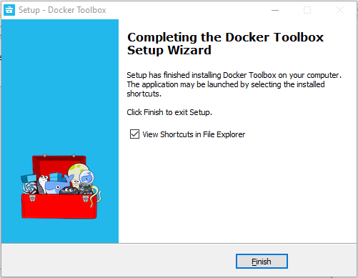

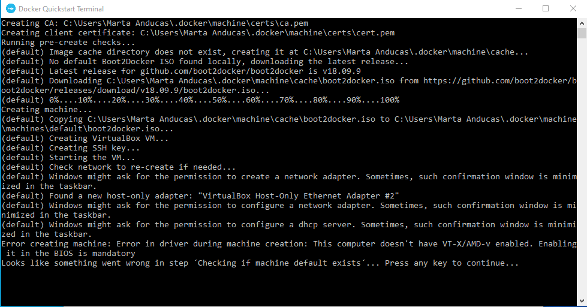

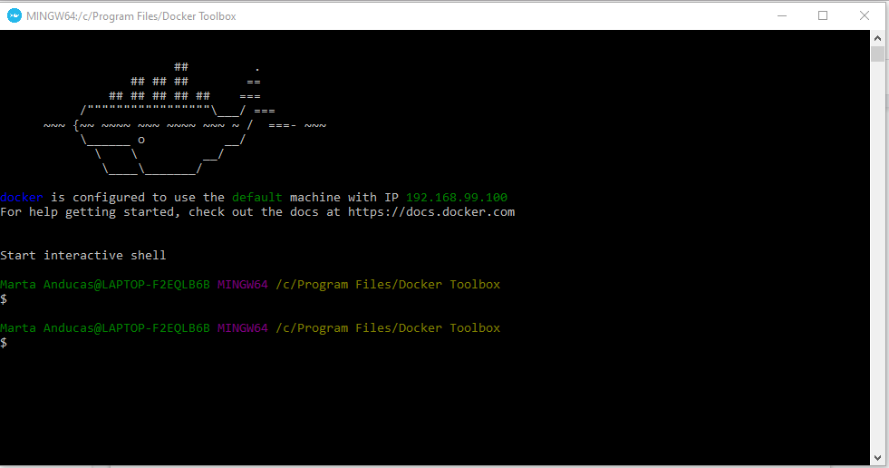

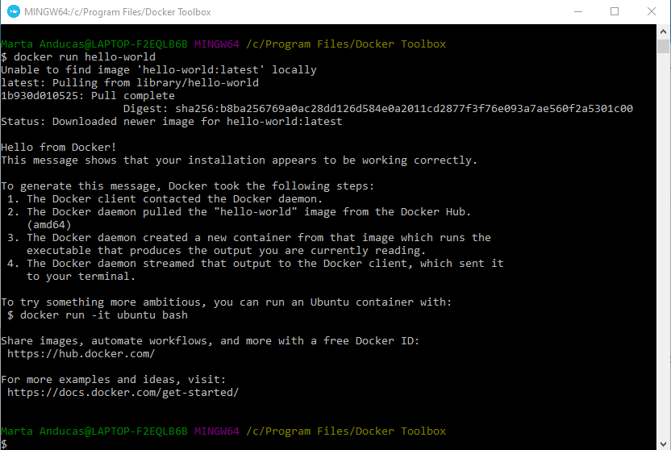

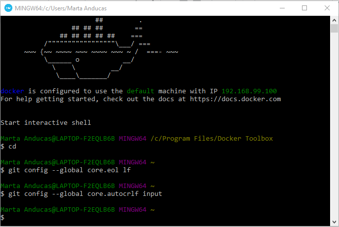

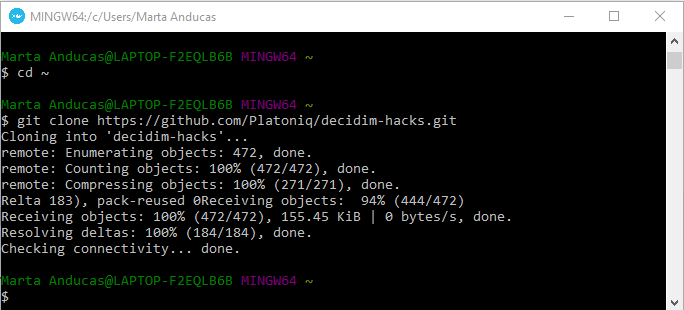

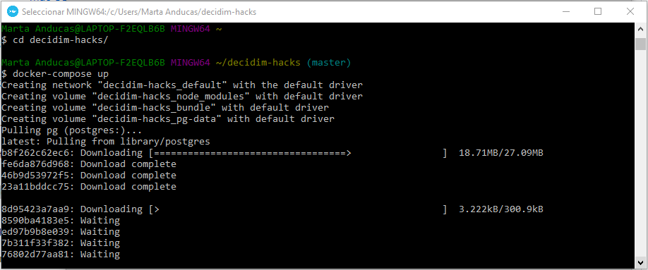

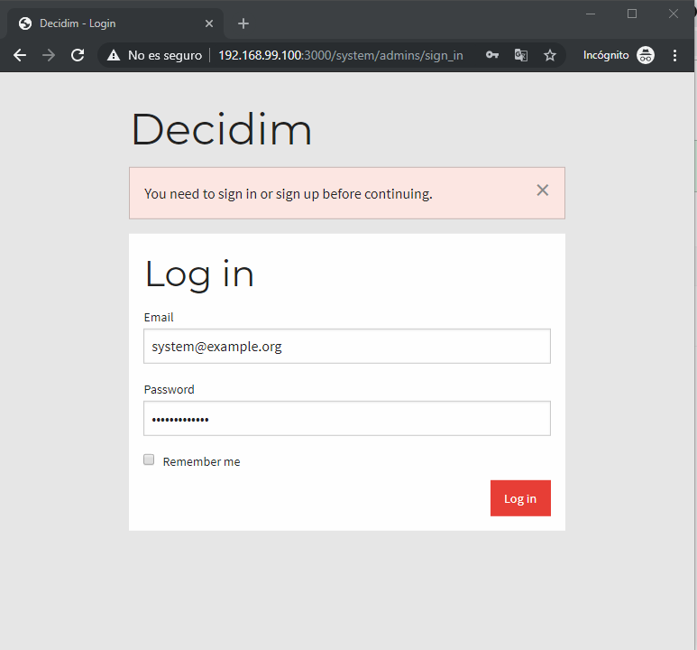

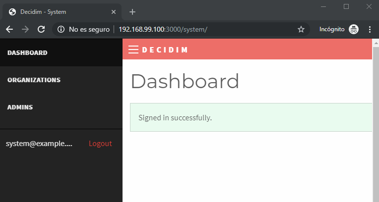

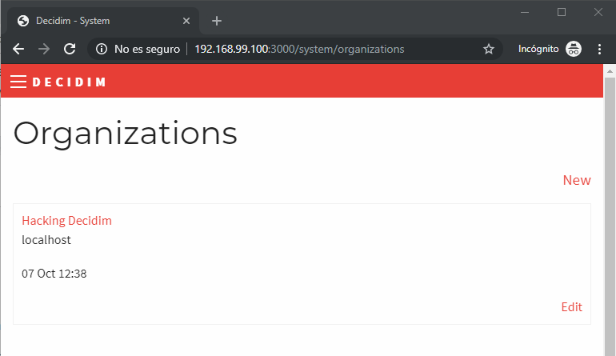

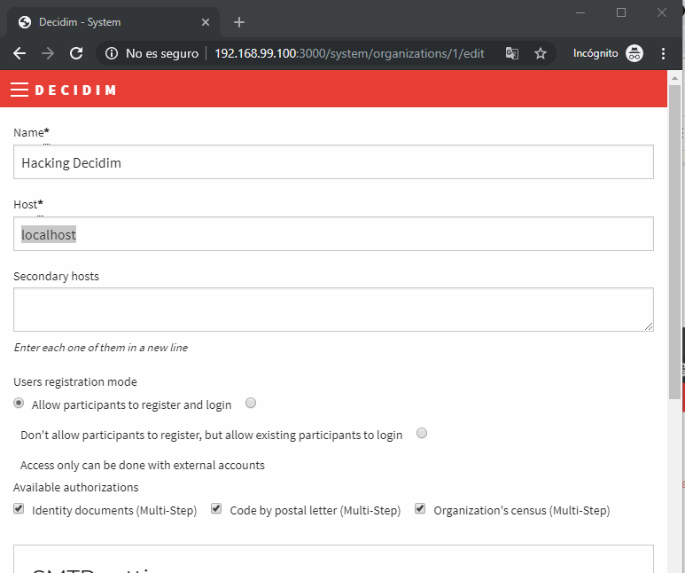


## Window helpers
Set the default organization to use the address http://192.168.99.100:3000

```
docker-compose exec app bin/rails db:seed:hostname-windows-toolbox
```

Somthing wrong? you can revert to the original address http://localhost:3000 with this command:

```
docker-compose exec app bin/rails db:seed:hostname-localhost
```

